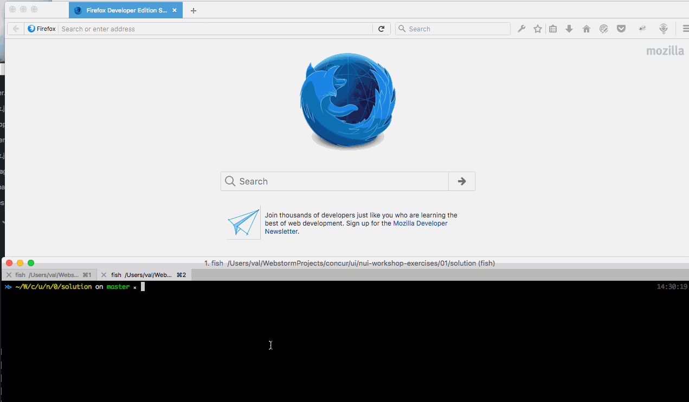

# Introducing Node and Express

## Exercise:
- Create an express server which serves a static html file
Go to http://localhost:3000/static and see “Hello world” page

- Create a simple JSON service that returns an array of locations of size N where N is passed into the service as a query a parameter.
curl ‘http://localhost:3000/api/v1/locations?num=5 will result in [{loc1},{loc2}, …,{loc5}]



## Steps:
### - Verify node version:

```
node -v
```
(should show v4.x.x or higher)
    - if node is missing install it from https://nodejs.org

### - Verify npm version:


```
npm -v
```

(should show v3.x.x or higher) if running on version 2, run

```
npm install -g npm@latest
```

### - Install express package
```
cd nui-workshop-exercises
npm install express --save
```

### - Create src/server.js file

### - Create static/index.html file

### - Create static/app.js file

### - install uuid package
```
cd nui-workshop-exercises
npm install --save uuid
```

### - Create src/service/locations.js

### - import locations.js and create locations service in server.js

### - start node and test your app
```
node src/server.js
```
- point your browser to http://localhost:3000/static and make sure you see  "Hello world"

- point your browser to http://localhost:3000/locations and make sure you are
getting the list of locations. Play with ?num=N query string. Make sure number of returned locations matches N.
