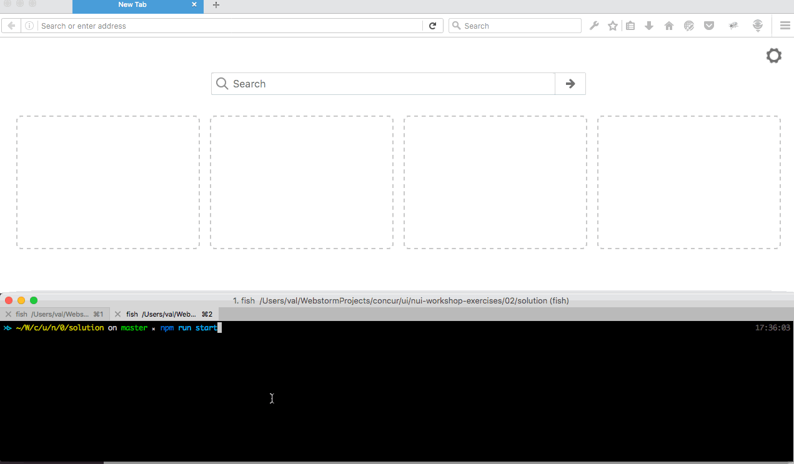

# Introducing Babel and ES6

## Tasks:
- refactor express server in step 1 to use babel.
- Add a service for a post which adds a new location, using destructuring on the
body to get the data. Curl with post to http://localhost:3000/api/v1/locations,
{Contry: "USA" city:”Chicago”, numEmployees:5}

## Bonus
- why persisting on the filesystem or in browser memory is bad BAD?




## Steps:

### - install babel-cli and babel plugins & presets as devDependencies
```
cd nui-workshop-exercises
npm install --save-dev babel-cli babel-plugin-transform-object-rest-spread babel-plugin-transform-runtime babel-preset-es2015 babel-preset-es2017 body-parser
```
### create .babelrc file
- Add "transform-runtime",  "transform-object-rest-spread" to plugins
- Add "es2017", "es2015" to presets


### - make sure build scripts are in package.json file
- Add build scripts to scripts section
- as this is an example workshop, for each exercise to share
- same node_modules, make sure scripts are executed from ../../node_modules/.bin
```json
scripts: {
    "build": "../../node_modules/.bin/babel src --out-dir=lib",
    "prestart": "npm run build",
    "start": "node lib/server.js",
}
```

### rewrite service/locations.js to use ES6
- use map to assign id on each lement
- produce updateLocation method that appends location passed as an argument into the global list of locations

### modify src/server.js
- rewrite src/server.js to use ES6
- add save location  service
- add bodyParser and make sure app is using it

### - change static/app.js
 - use some es6 statemets $ for formatting the output


### change static/index.html
-  serve app.js file from lib/ folder

### kickoff the server
```
npm run start
```
and see that http://localhost:3000/static, http://localhost:3000/locations?num=2 still work


### test your location PUT service by using curl command:
```
curl -H "Content-Type: application/json" -X POST -d '{"country": "Russia", "city": "St.Petersburg", "numEmployees": 1}' http://localhost:3000/location
```
- (should return you location you've added with generated id)

```
curl  http://localhost:3000/locations
```
- (should return you all locations, included the one you added in your pervious curl call)
